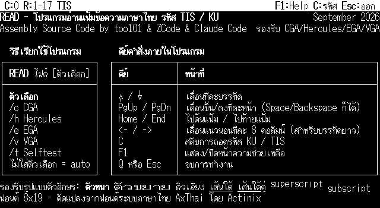

# read — โปรแกรมอ่านข้อความภาษาไทย (TIS-620)

*[Read in English](README.en.md)*

โปรแกรมอ่านไฟล์ข้อความภาษาไทยแบบเต็มจอ (full-screen text viewer) รองรับ
รหัส TIS-620 การประกอบสระ/วรรณยุกต์แบบ combining mark และสไตล์ตัวอักษรแบบ
WordStar (ตัวหนา/ตัวเอียง/ขีดเส้นใต้ ฯลฯ) เริ่มต้นเขียนเป็น x86 assembly
ล้วนสำหรับ DOS เมื่อหลายปีก่อน แล้วพอร์ตต่อมาเป็นวินโดวส์และ Linux โดยคง
ตรรกะแกนกลาง (byte classification, การแปลงรหัส KU/TIS, การประกอบตัวอักษร)
ไว้เหมือนเดิมทุกจุด เปลี่ยนแค่ชั้น windowing เป็นของแต่ละแพลตฟอร์ม

สามพอร์ตในที่เก็บนี้:

| โฟลเดอร์ | แพลตฟอร์ม | เขียนด้วย | สถานะ |
|---|---|---|---|
| [`dos/`](dos) | MS-DOS | x86 asm ล้วน (NASM) | ใช้งานจริงมานาน ผ่านการทดสอบเยอะที่สุด |
| [`windows/`](windows) | Windows (Win32 GUI) | x86 asm ล้วน (NASM, no CRT) | build ผ่าน ทดสอบแบบ static แล้ว (ยังไม่มี Wine ให้ทดสอบรันจริงในสภาพแวดล้อมนี้) |
| [`linux/`](linux) | Linux (X11/Xlib) | C | build ผ่าน และยืนยันด้วยภาพหน้าจอจริงแล้ว (Xvfb) |

แต่ละโฟลเดอร์มี README ของตัวเองอธิบายวิธี build, วิธีใช้, และรายละเอียด
ทางเทคนิคเฉพาะพอร์ตนั้น ๆ

## เริ่มต้นใช้งาน

ไปที่โฟลเดอร์ของแพลตฟอร์มที่ต้องการ แล้วดู README ในนั้น — สรุปสั้น ๆ:

```
# DOS (หรือ DOSBox)
cd dos && python3 build_read.py && output\read.com [ไฟล์]

# Windows
cd windows && build.bat && read.exe [ไฟล์]

# Linux
cd linux && ./build.sh && ./read [ไฟล์]
```

ไม่ใส่ชื่อไฟล์ = แสดงหน้า help ในตัว ปุ่มควบคุมพื้นฐานเหมือนกันทั้งสาม
พอร์ต: ลูกศร/PgUp/PgDn/Home/End เลื่อนดูเนื้อหา, `C` สลับรหัส KU/TIS,
`F1` เปิด/ปิดหน้า help, `Q`/Esc ออกจากโปรแกรม

ทั้งพอร์ตวินโดวส์และ Linux รองรับ **หน้าต่างปรับขนาดได้ (resizable)** —
ลากขยาย/ย่อแล้วจำนวนคอลัมน์/บรรทัดที่แสดงปรับตามขนาดจริง (รายละเอียดอยู่ใน
README ของแต่ละพอร์ต)

## ไฟล์ WordStar ต้นฉบับเปิดด้วย read ได้ไหม

สั้น ๆ: ไฟล์จากโปรแกรม WordStar ตัวจริง (ของฝรั่ง) — **ไม่ได้** แต่รหัส
สไตล์แบบ WordStar ที่โปรแกรมไทยยุคนั้นอย่าง CW และ RW ใช้ — **ได้** ซึ่งก็
คือสิ่งที่ `read` (และต้นทาง `TREAD` ตามที่เล่าไว้ใน
[`dos/STORY.md`](dos/STORY.md)) ถูกสร้างมาให้รองรับตั้งแต่แรกอยู่แล้ว

สิ่งที่ `read` รองรับ: ไบต์ควบคุมชุดหนึ่งที่แทรกอยู่ในเนื้อความ TIS-620/KU
ธรรมดา — `0x02`/`0x05`/`0x0E`/`0x0F`/`0x12`/`0x13`/`0x14`/`0x15`/`0x16`/`0x17`
— ใช้สลับ ตัวหนา/ตัวขยาย 2 เท่า/ตัวเอียง (รองรับทั้งรหัสเอียงของ CW และ
ของ RW เพราะสองโปรแกรมนี้ใช้รหัสเอียงไม่ตรงกัน)/ขีดเส้นใต้เดี่ยว-คู่/ตัวยก-
ตัวห้อย ตรงตามที่ไฟล์ CW/RW เขียนไว้จริง — นี่คือ "สไตล์แบบ WordStar" ที่
เอกสารในโปรเจกต์นี้พูดถึง คือรหัสสไตล์แบบ CW/RW ไม่ใช่การทำ WordStar
รูปแบบไฟล์จริงขึ้นมาใหม่

สิ่งที่ `read` **ไม่รองรับ และรองรับไม่ได้โดยโครงสร้าง**: ไฟล์จาก WordStar
ตัวจริงจะตั้งบิตสูงสุด (bit 7) ของบางไบต์ ASCII เพื่อใช้เป็นกลไกภายในของมัน
เอง (บอกจุดจบบรรทัดที่ตัดคำอัตโนมัติ, soft hyphen และอื่น ๆ) ซึ่งเป็น
ธรรมเนียมที่ตั้งอยู่บนข้อความอังกฤษ 7 บิตล้วน ในขณะที่รหัส TIS-620 (และ KU)
ของไทยใช้บิตสูงสุดนี้เป็นส่วนหนึ่งของไบต์อักขระไทยจริงอยู่แล้วทุกตัว (ทั้ง
ช่วง `0xA1`–`0xFE` และไบต์เทียบเท่าฝั่ง KU) จึงไม่มีทางแยกได้เลยว่าบิตสูงสุด
ที่ตั้งอยู่นั้นคือเครื่องหมายของ WordStar หรือคืออักขระไทยจริง — เป็นบิต
เดียวกันเป๊ะ `read` ไม่เคยพยายามอ่านธรรมเนียมนี้ และ `TREAD` ต้นทางก็ไม่เคย
เช่นกัน นอกจากนี้ไฟล์ WordStar จริงยังอาจมี header บอกรูปแบบไฟล์ และบรรทัด
"dot command" (`.pl`, `.bp`, `.ul` ฯลฯ) สำหรับจัดหน้ากระดาษ ซึ่ง `read` ไม่
แปลความหมายเลย — จะเห็นเป็นตัวอักษรดิบ ๆ เฉย ๆ

สรุป: ถ้าไฟล์มาจาก CW, RW, หรือ `read`/`TREAD` เอง — เปิดได้ถูกต้องแน่นอน
ส่วนไฟล์ `.WS` ที่มาจากโปรแกรม WordStar จริงสำหรับข้อความภาษาอังกฤษ ไม่ใช่
รูปแบบที่โปรแกรมนี้เคยตั้งใจจะรองรับ

## เอกสารเพิ่มเติม

- [`OPTIMIZATION.md`](OPTIMIZATION.md) — รายงานการ optimize พอร์ต DOS
  แบบละเอียด (ลดขนาดไฟล์, ลดการใช้ instruction, เทคนิคที่ใช้)
- [`dos/READ_TECHNICAL.md`](dos/READ_TECHNICAL.md) — เอกสารเทคนิคฉบับ
  สมบูรณ์ของพอร์ต DOS: สถาปัตยกรรม, memory map, ระบบทดสอบ, บั๊กที่เคยพบ
- [`dos/STORY.md`](dos/STORY.md) — ที่มาของโปรเจกต์

## ภาพตัวอย่าง



## License

[MIT](LICENSE)
