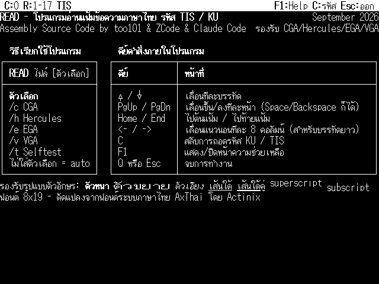

# READ.COM — โปรแกรมอ่านข้อความภาษาไทยสำหรับ DOS (ฉบับ optimize)

โปรแกรมดูข้อความภาษาไทยแบบเต็มจอ เขียนด้วย 8086 assembly (NASM, `.COM`)
รันได้บน CGA / EGA / VGA / Hercules เขียน VRAM ตรง ๆ ใช้ฟอนต์ไทย AXV 8×19
พร้อมแอตทริบิวต์แบบ WordStar (หนา, กว้างเป็น 2 เท่า, เอียง, ขีดเส้นใต้, ขีดเส้น
ใต้คู่, ตัวยก/ตัวห้อย), ตรวจจับ KU/TIS-620 อัตโนมัติ, มีหน้า help ในตัว

นี่คือเวอร์ชันที่เขียน `read.asm` ต้นฉบับใหม่เพื่อให้เล็กลงและเร็วขึ้น ให้
พิกเซล **ตรงกันทุกจุด** กับต้นฉบับบนข้อความจริง **เล็กลง ~50%** ใช้ cycle
**น้อยลง ~2.0–2.7 เท่าตอนเปิดโปรแกรม และน้อยลงสูงสุดถึง ~4.7 เท่าต่อการกดปุ่ม**
และแก้บั๊กแฝงในการวาดจออีกหลายจุด (ดู *ความถูกต้องและบั๊กที่แก้* ด้านล่าง)

## ภาพหน้าจอ

หน้า help ในตัว (กด F1) แสดงวิธีใช้และปุ่มลัดทั้งหมด:



## ไฟล์

| ไฟล์ | หน้าที่ |
|---|---|
| `read.asm` | โปรแกรมทั้งหมด |
| `STRS.INC` | สตริงต่าง ๆ + label ของตาราง KU→TIS |
| `KU.INC` | ตารางแปลง KU → TIS-620 |
| `STATUS.INC` | ป้ายข้อความของ status bar |
| `AXV.FON` | ฟอนต์ไทย 8×19, 256 glyph (ไบนารี, ถูกบีบอัดตอน build) |
| `HELP.TXT` | เนื้อหา help ในตัว (TIS-620 + รหัสสไตล์, ถูกบีบอัดตอน build) |
| `build_read.py` | สคริปต์ build (บีบอัดข้อมูล, เรียก NASM, ตัด pad ทิ้ง) |

## Build

ต้องมี [NASM](https://nasm.us/) (2.x หรือ 3.x)

```
python build_read.py
```

สคริปต์จะบีบอัดแบบ run-length `AXV.FON` + `HELP.TXT` ลง `packed.bin` ก่อน
(สร้างใหม่ทุกครั้งที่ build) แล้วเรียก NASM ประกอบ `read.asm` จากนั้นตัด pad
ขนาด 0x100h ที่ NASM 3.x แปะไว้ทิ้ง (เพราะมันไม่สนใจ `org` ตอนใช้โหมด `-f bin`)
ผลลัพธ์: `output/read.com` (สคริปต์จะสร้างโฟลเดอร์ `output/` ให้เองใต้ตำแหน่ง
เดียวกับ `read.asm` ถ้ายังไม่มี)

## รันโปรแกรม

```
READ filename            ตรวจจับการ์ดจอเอง
READ filename /v|/e|/c|/h   บังคับ VGA / EGA / CGA / Hercules
READ /t                  selftest
```

## ปุ่มควบคุม

```
Up/Dn        เลื่อนทีละบรรทัด      PgUp/PgDn หรือ Space/BS  เลื่อนทีละหน้า
Home/End     บนสุด/ล่างสุด         Left/Right               เลื่อนแนวนอน 8 คอลัมน์
c            สลับ KU <-> TIS       r / R                    วาดจอใหม่ทั้งหน้าจอ
q หรือ Esc   ออกจากโปรแกรม         F1                       หน้า help ในตัว
```

## ผลลัพธ์

วัดเทียบกับไบนารีต้นฉบับ (`read_orig.com`, 15,349 ไบต์):

| ตัวชี้วัด | เดิม | Optimize แล้ว | ดีขึ้น |
|---|---:|---:|---:|
| ขนาดไบนารี | 15,349 B | 7,674 B | **เล็กลง 50.0% (2.00×)** |
| เปิดโปรแกรม + วาดจอครั้งแรก (cycle) | ~6.0–7.9 M | ~2.2–3.3 M | **เร็วขึ้น ~2.4–2.7×** |
| วาดจอใหม่ต่อการกดปุ่ม (cycle) | ~1.3–2.1 M | ~0.36–0.89 M | **เร็วขึ้น ~2.3–4.7×** |

ตัวเลข cycle มาจากโมเดลจับเวลาแบบ 8086 บน emulator ที่แม่นระดับคำสั่ง
(Unicorn) เฉลี่ยจากหน้า help และเนื้อหาไทย/TIS/KU ผสมกันในทุกโหมดจอ

## ทำให้เร็วขึ้นและเล็กลงได้อย่างไร

- **ตาราง class/translate 256 ช่อง** (`trc`): table lookup ครั้งเดียวแทนสาย
  `cmp`/`je` ยาว ๆ ที่เคยใช้จัดคลาสทุกไบต์ (ตัวจบบรรทัด, ตัวสลับสไตล์,
  สระ/วรรณยุกต์, ตัวควบคุมที่ต้องกลืน) และแปลง KU→TIS ไปด้วย rebuild ก็ต่อเมื่อ
  สลับหน้ารหัสเท่านั้น
- **Fast path แบบ inline สำหรับตัวอักษรธรรมดา**: ตัวฐานที่ไม่มีสไตล์ในโหมด
  planar (EGA/VGA) ถูก blit จากฟอนต์ลง VRAM ตรง ๆ ด้วย loop `movsb` แบบ
  unroll และตัวชี้ VRAM ที่วิ่งต่อเนื่อง — ไม่มีการ copy cell ไม่มีขั้นตอนใส่
  สไตล์ ไม่มี dispatch
- **ตาราง scanline LUT ใช้ทุกที่** (`vrow_tab`): ตารางที่อยู่เดียวใช้ได้ทุกโหมด
  จอ (ทั้ง planar และ interleave) ทำให้ hot path ไม่ต้องคูณเลขหาสแกนไลน์อีก
- **อ่าน/เขียนหน่วยความจำทีละ word**: การล้างจอ, แถบ status bar สีกลับ, การ
  ประกอบ cell และการเลื่อนจอใน VRAM ย้ายข้อมูลทีละ 2 ไบต์
- **ตาราง dispatch คีย์** แทนที่สายเช็ค `cmp` คีย์แบบเรียงลำดับ
- **บีบอัดข้อมูล**: ฟอนต์และเนื้อหา help ถูกบีบอัดแบบ run-length
  (6,164 → ~3,660 ไบต์) แล้วคลายลง BSS ตอนเปิดโปรแกรม
- **ข้อมูลที่ zero ไว้ล่วงหน้าอยู่ใน BSS**: ตัวแปร/สถานะชั่วคราวทั้งหมดถูกจอง
  พื้นที่ไว้ (ไม่ได้เก็บเป็นไบต์ในไฟล์) แล้วเคลียร์ครั้งเดียวตอนเปิดโปรแกรม
  ลดขนาดไฟล์บนดิสก์
- **ลบโค้ดที่ไม่ใช้ทิ้ง**: path การประกอบวรรณยุกต์ที่ไม่มีทางถูกเรียกถึง,
  flag ความสูง cell ที่ไม่มีใครใช้ และของตกค้างอื่น ๆ ถูกลบออกหมด

## ความถูกต้องและบั๊กที่แก้

ตรวจสอบแล้วว่าพิกเซลตรงกับ reference ที่แก้บั๊กแล้วทุกจุด ครอบคลุมหน้า help
ในตัว, ตารางแปล KU/TIS, ทุกโหมดจอ และไฟล์สุ่มสร้างอีก ~600 ไฟล์ (ผสมตัวอักษร
ฐานไทย, สระ/วรรณยุกต์ซ้อนกัน, สไตล์แบบ WordStar ทุกแบบ, บรรทัดยาว, ตัวจบบรรทัด
แปลก ๆ, ไฟล์ว่าง/บรรทัดเดียว/ไม่มี EOL, ไฟล์ที่ไม่มีอยู่จริง) เลื่อนดูด้วยทุก
ปุ่ม

ระหว่างทางการเขียนใหม่ยังแก้บั๊กแฝงที่มีอยู่ในต้นฉบับไปด้วย:

1. **Status bar เพี้ยนตอนเลื่อนจอ** เมื่อช่วงบรรทัดที่แสดงมีจำนวนหลักเพิ่มขึ้น
   (เช่น `R:1-24` → `R:11-34` ที่บรรทัด 11) การเทียบ shadow ทีละไบต์ของ
   ต้นฉบับจะคลาดกันและวาดทับคอลัมน์ **ชื่อไฟล์** ด้วย glyph ผิด — เห็นเป็น
   `\cw\CWi6.DOC` ซ้อนกันตอนเลื่อนจอ ตัวที่เขียนใหม่วาดใหม่แค่คอลัมน์ตัวเลขเมื่อ
   จำนวนหลักไม่เปลี่ยน และวาดทั้งแถบใหม่สะอาด ๆ เมื่อจำนวนหลักเปลี่ยน
2. **`exp_prev` ค้างหลังตัวอักษรขยาย** ทำให้สระ/วรรณยุกต์ที่ตามมาถูกวางเลื่อน
   ไป 1 คอลัมน์
3. **การเลื่อนจอบางส่วนใน VRAM** ตอนนี้วาดใหม่ *ทุก* แถวที่เพิ่งโผล่มา (เดิม
   วาดแค่แถวเดียว) ทำให้การเลื่อนหลายบรรทัดเร็ว ๆ ไม่ทิ้งแถวเก่าค้างอีก
4. **`cur_col` ไม่ล้นวนกลับ 0 อีกต่อไป** บนบรรทัดที่ยาวผิดปกติเกิน 255 คอลัมน์
   (ซึ่งเดิมทำให้เกิดรอยขยะที่คอลัมน์ 0)
5. การ์ดป้องกันเล็กน้อยเรื่องคอลัมน์สุดท้าย/glyph กว้าง และความสม่ำเสมอของการ
   ตัด `ESC` ระหว่างตัวโหลดไฟล์กับตัววาดจอ
6. **ไบต์ `00` แทรกกลางไฟล์ไม่ทำให้แสดงผลไม่จบอีกต่อไป** เดิมถือว่าไบต์ `00`
   ตัวใดก็ตามในเนื้อหาไฟล์คือจุดจบข้อความ — ทั้งตอนนับบรรทัดและตอนวาด — ทำให้
   เอกสารจริงที่ใช้ไบต์ `00` เป็น filler glyph (เช่น แถวตารางแบบตีเส้น) ถูกตัด
   จบไปก่อนถึงจุดจบจริงมาก ตอนนี้ `00` เป็นแค่ไบต์ควบคุมที่ถูกกลืนเหมือนตัวอื่น
   มีแค่ `0D`/`0A` เท่านั้นที่จบบรรทัด ส่วน `1A` (`^Z`) ยังคงความหมายจบไฟล์แบบ
   ธรรมเนียมเดิมไว้ และมีตำแหน่ง "จุดจบจริงของเนื้อหาที่โหลดมา" ที่บันทึกไว้
   ครั้งเดียว (โดยตัวโหลดไฟล์) เป็นตัวหยุดการอ่าน/วาดจริง — ไม่ใช่ค่าของไบต์
   ตัวใดตัวหนึ่ง
7. **Selftest (`/t`) ไม่รอ 15 วินาทีอีกต่อไป** ตอนนี้แสดงผลแล้วกลับสู่ DOS
   ทันทีที่กดคีย์ใดก็ได้
8. **Tab (`09`) ขยายเป็น 8 ช่องว่างแล้ว** แทนที่จะวาดเป็น glyph ขยะจากฟอนต์
   ให้พิกเซลตรงกับการพิมพ์ช่องว่าง 8 ตัวจริง ๆ เป๊ะ และนับเป็น 8 คอลัมน์สำหรับ
   ความยาวบรรทัด/การเลื่อนแนวนอนด้วยเช่นกัน
9. **บรรทัดพอดี 80 คอลัมน์แต่ยังเลื่อนขวาได้** (พบตอนใส่ `HELP.TXT` ที่ตั้งใจ
   ทำให้พอดี 80 คอลัมน์ แล้วยังเลื่อนขวาได้อยู่) ต้นเหตุคือตอนคำนวณความกว้าง
   บรรทัด ไบต์สลับสไตล์ (ตัวหนา/ตัวเอียง/ตัวขยาย/ขีดเส้นใต้ ฯลฯ) ถูกนับเป็น 1
   คอลัมน์ต่อไบต์ ทั้งที่ตอนวาดจอจริงไบต์พวกนี้กว้าง 0 คอลัมน์เสมอ — บรรทัดที่
   เห็น 80 คอลัมน์แต่มีไบต์สลับสไตล์แทรกอยู่ 14 ไบต์ (เช่นบรรทัดตัวอย่างสไตล์ใน
   หน้า help) จึงถูกนับผิดเป็น 94 คอลัมน์ เกิน 80 แล้วเปิดเลื่อนขวาทั้งที่ไม่มี
   อะไรตกขอบจริง แก้โดยไม่นับไบต์สลับสไตล์เป็นคอลัมน์อีกต่อไป (กว้าง 0 เหมือน
   ตอนวาดจอ)
10. **หน้า help สืบทอดขีดจำกัดเลื่อนขวาจากไฟล์ที่เปิดค้างไว้** ตอนกด F1 โปรแกรม
    นับจำนวนบรรทัดของ help ใหม่ แต่ไม่ได้คำนวณขีดจำกัดเลื่อนขวาใหม่ตาม จึงยังใช้
    ค่าที่เหลือจากไฟล์ก่อนหน้า ถ้าไฟล์นั้นกว้างกว่า 80 คอลัมน์ หน้า help ก็เลื่อน
    ขวาได้ตามไปด้วยทั้งที่เนื้อหา help เองไม่ได้กว้างขนาดนั้น แก้ให้คำนวณขีด
    จำกัดเลื่อนขวาของ help ใหม่ทุกครั้งที่เข้าหน้า help
11. **ค่าความกว้างบรรทัดสูงสุดไม่เคยรีเซ็ต** ระหว่างเซสชันเดียวกัน ถ้าเคยเปิด
    ไฟล์ที่กว้างเกิน 80 คอลัมน์มาก่อน ค่านี้จะค้างสูงตลอดไป ทำให้ไฟล์หรือหน้า
    help ที่เปิดถัดมา — แม้กว้างพอดี 80 คอลัมน์จริง ๆ — ยังถูกคำนวณว่าเลื่อนขวา
    ได้อยู่ดี แก้โดยรีเซ็ตค่านี้กลับ 0 ทุกครั้งที่เริ่มสแกนตารางบรรทัดใหม่
12. **ขีดจำกัดเลื่อนขวา hardcode ไว้ที่ 80 คอลัมน์ทุกโหมด ทั้งที่ Hercules
    แสดงได้จริง 90 คอลัมน์** — โหมด HGC (720×348) มีจอกว้างพอ 90 คอลัมน์
    (720÷8) และตัววาดจอก็ใช้ 90 จริง แต่ตัวคำนวณขีดจำกัดเลื่อนขวายังลบด้วยเลข
    80 คงที่เสมอ ทำให้บรรทัดกว้าง 81–90 คอลัมน์บน Hercules — ซึ่งแสดงพอดีอยู่
    แล้วไม่มีอะไรตกขอบ — ยังถูกคำนวณผิดว่าต้องเปิดเลื่อนขวา **บั๊กนี้มีมาตั้งแต่
    ต้นฉบับก่อน optimize** ไม่ใช่สิ่งที่เพิ่งเกิดจากการแก้ข้อ 9–11 ข้างต้น แก้
    โดยให้อ้างอิงความกว้างจริงของแต่ละโหมด (80 สำหรับ CGA/EGA/VGA, 90 สำหรับ
    HGC) แทนเลข 80 คงที่ — จุดนี้เป็นจุดเดียวในเอกสารนี้ที่ทำให้ผลบนโหมด
    Hercules **ต่างจากไบนารีต้นฉบับโดยตั้งใจ** (บรรทัดกว้าง 81 คอลัมน์ขึ้นไป
    บน HGC เท่านั้น) ส่วน CGA/EGA/VGA ไม่กระทบเลยเพราะความกว้างจริงของ 3 โหมด
    นั้นคือ 80 อยู่แล้ว
